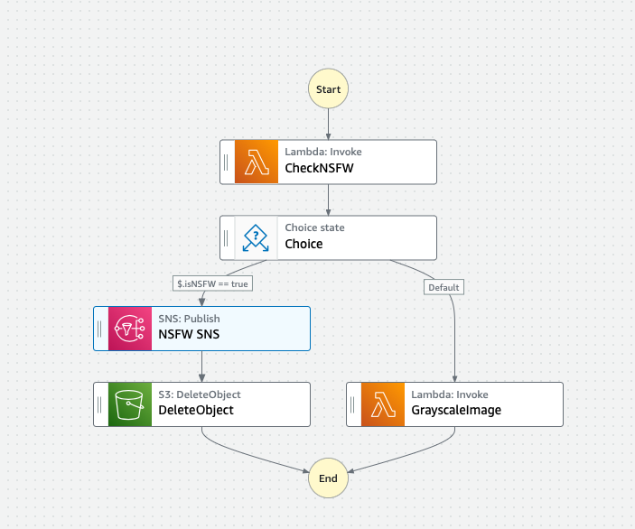

# aws-testing-step-functions
A repository for implementing example AWS Step Functions and their automated tests

# Work in Progress

### How to build and deploy
You can build the projects lambdas by running `npm run build`.  
For convenience deploy and destroy scripts were created.  
- Make the shell scripts executable: `chmod +x deploy.sh` and `chmod +x destroy.sh`.
- To deploy the stack run `./deploy.sh`.
    - Deploys a stack which creates: IAM Role to access all S3 buckets, 2 S3 buckets, 2 lambdas with "Hello World".
    - Uploads `apple.png` to the input s3 bucket.
    - Builds the code using `npm run build` for the 2 lambdas.
    - Zips the contents of the build directory into `index.zip`.
    - Updates the Lambda functions with the newly built code.
- To destroy the stack run `./destroy.sh`.
    - Deletes all files from the input and output s3 buckets.
    - Destroys the stack created by `./deploy.sh`.

## Lambda Functions

### Grayscaler
A lambda function that receives a bucket and a key as an input, then turns the image into grayscale.  
After successfully grayscaling the image, it is saved into a second S3 bucket defined in the CF stack.  

### Nsfwcheck
A lambda function which uses AWS Rekognition to check for NSFW content of the images using `DetectModerationLabels`.  
The input is an event from AWS EventBridge for an object created in an S3 bucket.
The output is a JSON containing if the picture is NSFW and the bucket name and key.

## To improve
- Restrict the created IAM role to only the created buckets.
- Introduce step functions to the CF Stack.
- Add AWS EventBridge to the CF Stack.
- Add AWS SNS to the stack - the plan is to publish a message here when a picture is deemed NSFW.

The general aim is to have a stepfunction similar to this:  
